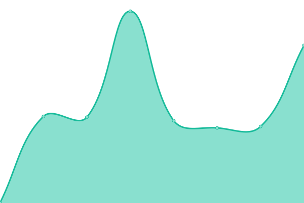
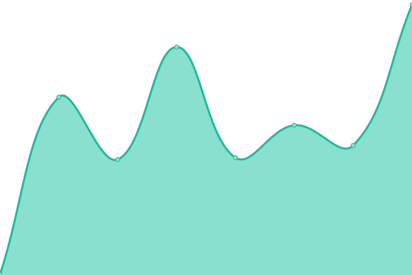
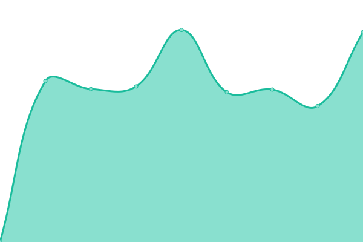

# [📈 Live Status](https://demo.upptime.js.org): <!--live status--> **🟧 Partial outage**

This repository contains the open-source uptime monitor and status page for [Dmitriy Pavlov](https://demo.upptime.js.org), powered by [Upptime](https://github.com/upptime/upptime).

With [Upptime](https://upptime.js.org), you can get your own unlimited and free uptime monitor and status page, powered entirely by a GitHub repository. We use [Issues](https://github.com/D-pavlo-v/availability_checker/issues) as incident reports, [Actions](https://github.com/D-pavlo-v/availability_checker/actions) as uptime monitors, and [Pages](https://demo.upptime.js.org) for the status page.

<!--start: status pages-->
<!-- This summary is generated by Upptime (https://github.com/upptime/upptime) -->
<!-- Do not edit this manually, your changes will be overwritten -->
<!-- prettier-ignore -->
| URL | Status | History | Response Time | Uptime |
| --- | ------ | ------- | ------------- | ------ |
|  [Vagonmaster](https://vagonmaster.com) | 🟥 Down | [vagonmaster.yml](https://github.com/D-pavlo-v/availability_checker/commits/HEAD/history/vagonmaster.yml) | 

 4494ms
     
 | 

<a href="https://demo.upptime.js.org/history/vagonmaster">94.75%</a>
    

|  [Vagdepo](https://vagdepo.kz) | 🟩 Up | [vagdepo.yml](https://github.com/D-pavlo-v/availability_checker/commits/HEAD/history/vagdepo.yml) | 

 889ms
     
 | 

<a href="https://demo.upptime.js.org/history/vagdepo">100.00%</a>
    

|  [SberQ](https://digital-assessment.ru) | 🟩 Up | [sber-q.yml](https://github.com/D-pavlo-v/availability_checker/commits/HEAD/history/sber-q.yml) | 

 911ms
     
 | 

<a href="https://demo.upptime.js.org/history/sber-q">100.00%</a>
    

|  [Online-Tor_test](https://online-tor.dunice-testing.com/) | 🟩 Up | [online-tor-test.yml](https://github.com/D-pavlo-v/availability_checker/commits/HEAD/history/online-tor-test.yml) | 

 1468ms
     
 | 

<a href="https://demo.upptime.js.org/history/online-tor-test">100.00%</a>
    

|  [Anex](https://anex.agency/) | 🟥 Down | [anex.yml](https://github.com/D-pavlo-v/availability_checker/commits/HEAD/history/anex.yml) | 

 0ms
     
 | 

<a href="https://demo.upptime.js.org/history/anex">0.00%</a>
    

|  [Moonshot_marketing](https://www.moonshot-marketing.com/) | 🟩 Up | [moonshot-marketing.yml](https://github.com/D-pavlo-v/availability_checker/commits/HEAD/history/moonshot-marketing.yml) | 

 198ms
     
 | 

<a href="https://demo.upptime.js.org/history/moonshot-marketing">100.00%</a>
    

|  [Sibirian_health](https://ru.siberianhealth.com/ru/) | 🟩 Up | [sibirian-health.yml](https://github.com/D-pavlo-v/availability_checker/commits/HEAD/history/sibirian-health.yml) | 

 3702ms
     
 | 

<a href="https://demo.upptime.js.org/history/sibirian-health">99.85%</a>
    

|  [Restrek](https://www.restrek.com/) | 🟩 Up | [restrek.yml](https://github.com/D-pavlo-v/availability_checker/commits/HEAD/history/restrek.yml) | 

 444ms
     
 | 

<a href="https://demo.upptime.js.org/history/restrek">100.00%</a>
    

<!--end: status pages-->

[**Visit our status website →**](https://demo.upptime.js.org)

## 📄 License

- Powered by: [Upptime](https://github.com/upptime/upptime)
- Code: [MIT](./LICENSE) © [Dmitriy Pavlov](https://demo.upptime.js.org)
- Data in the `./history` directory: [Open Database License](https://opendatacommons.org/licenses/odbl/1-0/)
